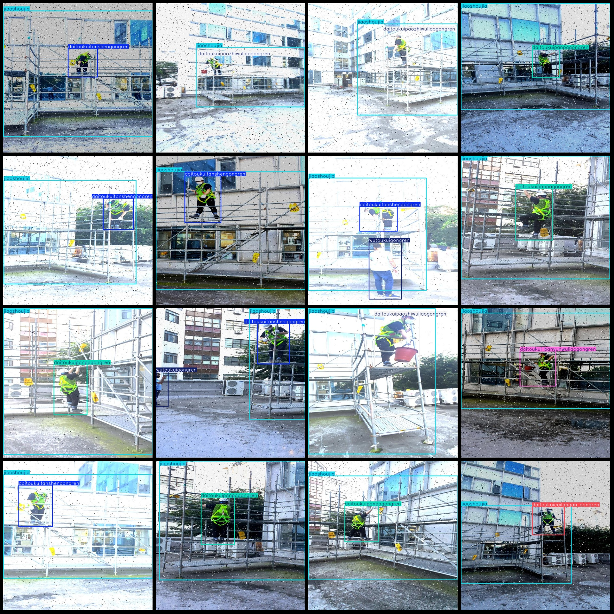
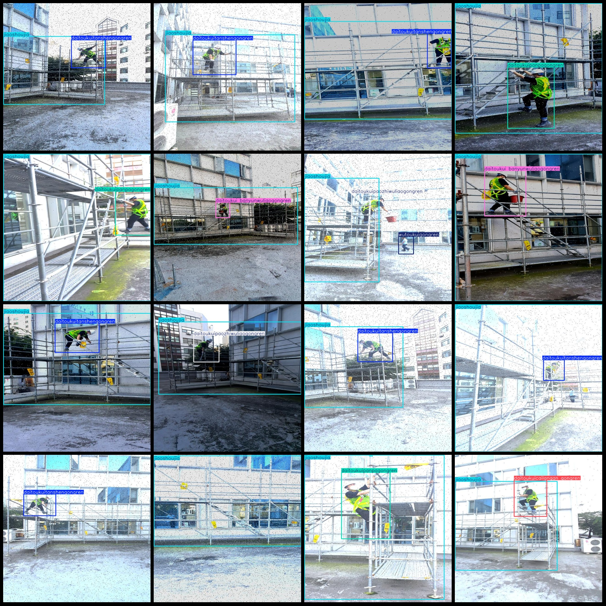

# Intelligent Construction Site Workers' High-altitude Construction Safety Detection Data Set VOC+YOLO format with 4788 images and 8 categories enhanced.

Please note that the dataset contains a large number of enhancements. The dataset is simulated by capturing videos and forming images, so there are many duplicate images.
Dataset format: Pascal VOC format + YOLO format (without split paths in the txt file, only including jpg images as well as corresponding VOC format xml files and YOLO format txt files).
number of images: 4788  
annotation count: 4788  
annotation count: 4788  
annotationnumber of classes: 8  
Annotation class names (note the Yolo format order doesn't match this, but it should be based on the 'labels' folder's 'classes.txt'): ["DaiToukuiBanyunWuliaogongren", "DaiToukuicaiLanganGongren", "DaiToukuiGongren", "DaiToukuiPanPagongren", "DaiToukuiPaoZhiWuliaogongren", "DaiToukuitanShengGongren", "JiaoShouJia", "WutouKuiGongren"]
["Helmets-wearing Material Handling Workers", "Helmets-wearing Barrier Crossing Workers", "Helmets-wearing Workers", "Helmets-wearing Climbing Workers", "Helmets-wearing Throwing Material Workers", "Helmets-wearing Scrambling Workers", "Staff-standing", "No Helmets Workers"]
boxes per class:   
daitoukui banyunwuliaogongren box count = 892  
daitoukuicailangan gongren box count = 541  
daitoukuigongren box count = 92  
daitoukuipanpagongren box count = 974  
daitoukuipaozhiwuliaogongren box count = 956  
daitoukuitanshengongren box count = 1255  
jiaoshoujia box count = 4755  
wutoukuigongren box count = 118  
total boxes: 9583  
images per class:   
daitoukui banyunwuliaogongren images = 892  
daitoukuicailangan gongren images = 541  
daitoukuigongren images = 92  
daitoukuipanpagongren images = 974  
daitoukuipaozhiwuliaogongren images = 956  
daitoukuitanshengongren images = 1255  
jiaoshoujia images = 4752  
wutoukuigongren images = 115  
image resolution: 640x640  
The annotation tool "labelImg" is a tool for labeling images using YOLO (You Only Look Once) object detection. It is used in the field of computer vision and image processing to automatically identify and label objects in images.

Here's a brief explanation of how it works:

1. The user uploads an image to the labelImg website or platform.
2. The system uses the YOLO model to analyze the image and detect objects within it.
3. The detected objects are then labeled with their corresponding categories, such as "person", "car", "dog", etc.
4. The labels are displayed on the image, providing additional information about the objects detected.

Some key features of labelImg include:

- Real-time analysis: The system can analyze the image in real time, allowing users to see the result immediately.
- High accuracy: The YOLO model is trained on large datasets, resulting in high accuracy in object detection.
- User-friendly interface: The labelImg website has a simple and intuitive interface that allows users to easily upload and view their images.
- Customizable labels: Users can customize the labels they want to see on the image, such as adding additional details or changing the order of the categories.

Overall, labelImg is a useful tool for anyone looking to automate the labeling process of images, especially those in industries such as healthcare, retail, or transportation.
Annotation rule: Draw a rectangle around the class.
It is important to note that the dataset does not have a split into training, validation, and test sets.
Special Statement: This dataset does not guarantee the accuracy of the trained model or the weight file.
Preview of images:
## Image

Here is a pay link on Stripe ( https://buy.stripe.com/3cs8yP7sY87d0vu9AB ). Please contact me lonlonago@foxmail.com after funding $89, and I will send you a complete data files , thank you!

